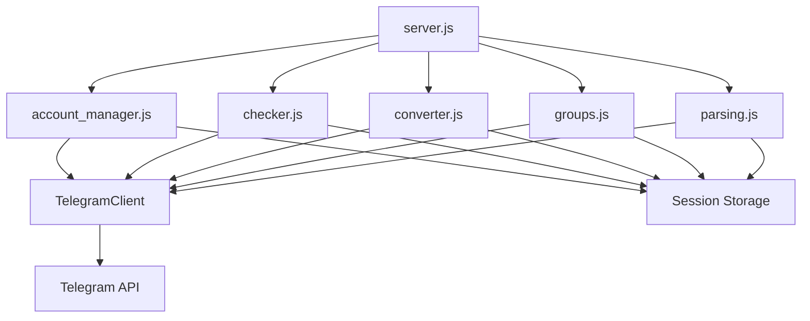

# TG Master - Документация проекта

## Описание проекта

TG Master - это REST API сервер для работы с Telegram API, предоставляющий функционал для управления аккаунтами, парсинга групп, проверки данных и конвертации форматов. Проект разработан на Node.js с использованием Express и библиотеки GramJS (telegram).

## Архитектура проекта

### Технологический стек

- **Runtime**: Node.js (ES Modules)
- **Framework**: Express.js 4.19.2
- **Telegram API**: telegram (GramJS) 2.22.2
- **Utilities**: nanoid 5.0.7

### Структура проекта

```
tg-master/
├── server.js              # Главный сервер и точка входа
├── account_manager.js     # Модуль управления аккаунтами и сессиями
├── checker.js             # Модуль проверки данных
├── converter.js           # Модуль конвертации форматов
├── groups.js              # Модуль работы с группами
├── parsing.js             # Модуль парсинга данных
├── package.json           # Зависимости и конфигурация
├── Dockerfile            # Docker образ для деплоя
├── docker-compose.yml    # Docker Compose конфигурация
├── .env.example           # Пример конфигурации окружения
├── .gitignore            # Игнорируемые файлы
└── docs/                  # Документация проекта
    ├── project.md        # Этот файл
    ├── changelog.md      # Журнал изменений
    ├── tasktracker.md    # Трекер задач
    └── deploy.md         # Инструкция по деплою
```

## Модули системы

### 1. Server.js (Главный сервер)

**Описание**: Основной файл приложения, инициализирует Express сервер и регистрирует все модули.

**Функционал**:
- Инициализация Express приложения
- Регистрация модулей (account_manager, checker, converter, groups, parsing)
- Обработка health check endpoint (`/v1/health`)
- Legacy endpoint для совместимости (`/v1/groups/summary_legacy`)
- Middleware для нормализации данных от n8n
- Фильтрация TIMEOUT ошибок из GramJS

**Endpoints**:
- `GET /v1/health` - Проверка работоспособности сервера
- `POST /v1/groups/summary_legacy` - Legacy endpoint для получения информации о группах

**Конфигурация**:
- `PORT` - Порт сервера (по умолчанию: 8080)
- `ADMIN_TOKEN` - Токен для авторизации (опционально)
- `DATA_DIR` - Директория для данных (по умолчанию: `/app/data`)
- `SESS_DIR` - Директория для сессий (`/app/data/sessions`)

### 2. Account Manager (account_manager.js)

**Описание**: Модуль для управления Telegram аккаунтами и сессиями с поддержкой SRP-2FA аутентификации.

**Функционал**:
- Создание и сохранение сессий Telegram
- Авторизация с поддержкой 2FA (двухфакторной аутентификации)
- Управление сессиями (список, удаление)
- Безопасное хранение session strings

**Endpoints**:
- `GET /v1/auth/session` - Получить список всех сессий
- `POST /v1/auth/session` - Сохранить готовую сессию
- `DELETE /v1/auth/session/:name` - Удалить сессию
- `POST /v1/auth/login` - Начать процесс авторизации
- `POST /v1/auth/login/2fa` - Завершить авторизацию с 2FA
- `POST /v1/auth/login/password` - Завершить авторизацию с паролем

**Безопасность**:
- Использование SRP (Secure Remote Password) протокола
- Валидация session names
- Защита endpoints через `ADMIN_TOKEN`

### 3. Checker (checker.js)

**Описание**: Модуль для проверки различных данных через Telegram API.

**Функционал**:
- Проверка доступности и валидности данных
- Работа с Telegram клиентами
- Обработка ошибок и flood wait

**Endpoints**:
- `POST /v1/checker/*` - Различные endpoints для проверки данных

**Особенности**:
- Поддержка нескольких путей для хранения сессий
- Автоматическое переподключение при ошибках
- Обработка FLOOD_WAIT ошибок

### 4. Converter (converter.js)

**Описание**: Модуль для конвертации данных между различными форматами.

**Функционал**:
- Конвертация типов чатов
- Преобразование данных между форматами
- Работа с Telegram сущностями

**Endpoints**:
- `POST /v1/converter/*` - Endpoints для конвертации данных

**Особенности**:
- Определение типов чатов (channel, supergroup, group)
- Нормализация данных

### 5. Groups (groups.js)

**Описание**: Модуль для работы с Telegram группами и каналами.

**Функционал**:
- Получение информации о группах
- Парсинг данных групп
- Нормализация входных данных для n8n
- Поддержка различных форматов входных данных

**Endpoints**:
- `POST /v1/groups/summary` - Получить сводную информацию о группах

**Особенности**:
- Нормализация usernames (добавление @, приведение к нижнему регистру)
- Поддержка различных форматов входных данных (массивы, строки, объекты)
- Обработка русскоязычных ключей для совместимости с n8n
- Debug режим через переменную окружения `DEBUG_GROUPS`

### 6. Parsing (parsing.js)

**Описание**: Модуль для парсинга данных из Telegram.

**Функционал**:
- Парсинг сообщений
- Извлечение данных из групп и каналов
- Безопасные задержки для избежания rate limits
- Обработка flood wait ошибок

**Endpoints**:
- `POST /v1/parsing/*` - Различные endpoints для парсинга

**Особенности**:
- Настраиваемые задержки через `SAFE_BASE_DELAY_MS`
- Jitter для случайных задержек
- Автоматическая обработка FLOOD_WAIT
- Безопасные вызовы API с retry логикой

## Взаимодействие модулей



## Конфигурация окружения

### Переменные окружения (.env)

```env
# Порт сервера
PORT=8080

# Токен администратора (опционально)
ADMIN_TOKEN=your_secret_token

# Базовая задержка для безопасных запросов (мс)
SAFE_BASE_DELAY_MS=1200

# Режим отладки для модуля groups
DEBUG_GROUPS=1

# Директории данных (для production)
DATA_DIR=/app/data
```

## Безопасность

1. **Авторизация**: Защита endpoints через `ADMIN_TOKEN` (Bearer token)
2. **Валидация**: Проверка входных данных на всех уровнях
3. **Сессии**: Безопасное хранение session strings в файловой системе
4. **SRP**: Использование Secure Remote Password протокола для 2FA
5. **Rate Limiting**: Встроенные задержки для избежания блокировок

## API Response Format

Все endpoints возвращают единый формат ответа:

```json
{
  "success": true|false,
  "data": {...},
  "meta": {...},
  "error": {
    "code": "ERROR_CODE",
    "message": "Error message",
    "details": {...}
  }
}
```

### Успешный ответ:
```json
{
  "success": true,
  "data": {...},
  "meta": {
    "processed": 10,
    "ok": 8,
    "failed": 2,
    "took_ms": 1234
  },
  "error": null
}
```

### Ошибка:
```json
{
  "success": false,
  "data": null,
  "meta": null,
  "error": {
    "code": "BAD_REQUEST",
    "message": "api_id and api_hash are required",
    "details": null
  }
}
```

## Принципы разработки

1. **SOLID**: Следование принципам объектно-ориентированного программирования
2. **KISS**: Простота и понятность кода
3. **DRY**: Избежание дублирования кода
4. **Модульность**: Каждый модуль отвечает за свою область функциональности
5. **Единый стиль**: Консистентный код во всех модулях

## Запуск проекта

### Локальная разработка

```bash
# Установка зависимостей
npm install

# Запуск сервера
npm start

# Или напрямую
node server.js
```

### Деплой через Docker

```bash
# Сборка образа
docker-compose build

# Запуск в фоновом режиме
docker-compose up -d

# Просмотр логов
docker-compose logs -f

# Остановка
docker-compose down
```

Подробная инструкция по деплою на удаленный сервер доступна в [docs/deploy.md](deploy.md).

## Зависимости

- **express**: ^4.19.2 - Web framework
- **telegram**: ^2.22.2 - Telegram API client (GramJS)
- **nanoid**: ^5.0.7 - Генерация уникальных ID

## Версия

Текущая версия: **0.1.0**

## Лицензия

Не указана

## Автор

3dstepansky

